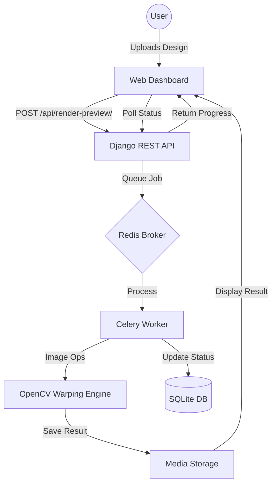

# Artisan AI: Product Customization Engine

AI-powered apparel customization platform using Django, Celery, Redis, and OpenCV. This system allows users to upload designs and preview them realistically on apparel with perspective warping and fabric conformation.

## ✨ Features
- **Smart Design Upload**: Support for drag-and-drop logo/artwork uploads.
- **Advanced Fabric Warping**: Uses displacement mapping to align designs naturally with fabric folds and wrinkles.
- **Perspective Alignment**: Automatically adjusts design perspective based on the product angle (Front, Side, Back).
- **Asynchronous Rendering**: High-performance pipeline powered by Celery to handle image processing in the background.
- **Premium UI/UX**: Sleek dark-mode dashboard with glassmorphism and real-time progress tracking.

## 🛠️ Tech Stack
- **Backend**: Django 6.0, Django REST Framework
- **Processing**: OpenCV, NumPy, Pillow
- **Task Queue**: Celery (with Redis as Broker/Backend)
- **Frontend**: Vanilla JS, Modern CSS (Glassmorphism), Bootstrap 5
- **Server**: Gunicorn, WhiteNoise

## 🚀 Run Locally

### 1. Prerequisite: Redis
Ensure Redis is installed and running on your system (default port `6379`).

### 2. Setup Environment
```powershell
# Clone the repository and navigate to the backend
cd backend

# Create and activate virtual environment
python -m venv venv
.\venv\Scripts\activate

# Install dependencies
pip install -r requirements.txt
```

### 3. Initialize Database & Assets
```powershell
# Run migrations
python manage.py migrate

# Seed database and generate sample assets
python manage.py seed_products
```

### 4. Start Services
Open two terminal windows:

**Terminal 1: Web Server**
```powershell
python manage.py runserver
```

**Terminal 2: Celery Worker**
```powershell
celery -A core worker --loglevel=info -P solo
```

Visit `http://127.0.0.1:8000` to start customizing.

## 🏗️ Architecture



## 📸 Screenshots

| Landing Page | Design Lab |
|--------------|------------|
|  |  |

---
**Note**: This project was developed as a recruiter-grade internship submission for the Artisan AI Product Engine role.
